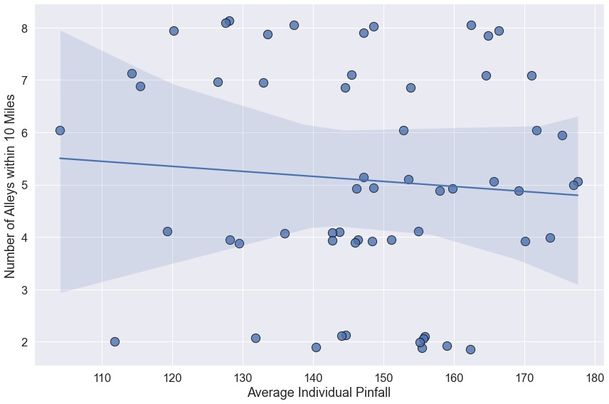

# **Cincinnati High School Bowling Stats**

This repo contains my final project for the Code Kentucky/Code Louisville Data Analysis 2 course.
The goal of this project: to collect data from the OHSAA Southwest District's conference web sites and visualize it beyond the text tables that are available on those sites.

# Code Kentucky/Code Louisville Requirements

1. I used the `requests` library to read data from [Census.gov](https://api.census.gov/data/2020/acs/acs5/subject?get=NAME,S1903_C03_001E&for=zip%20code%20tabulation%20area:*), as well as [OpenStreetMap](https://www.openstreetmap.org/). I also used `requests` in combination with `Beautiful Soup` to scrape bowling statistics from the six web sites of the Ohio High School Athletic Association's Southwest District conferences.

2. The data from Census.gov is returned from the API in JSON format (though as raw bytes), and is generally pretty clean and well-organized. OpenStreetMap likewise reutrns JSON-formatted data; most troubles I had with this were related to finding the right search terms to return the location info I intended. The OHSAA's sites contain logical, though verbose, HTML that was easy to parse. The data itself, however, was less consistent. While scores were generally straightforward, opponent and location data contained plenty of colloquial names (entered by hand by the coaches) rather than canonical ones. "Stones Lanes," for example, might be entered as "Stone Lanes," "Stones," or any misspellings of these. I attempted Gazetteer deduplication with [pandas-dedupe](https://pypi.org/project/pandas-dedupe/) as well as a more generalized approach with [python-Levenshtein](https://pypi.org/project/python-Levenshtein/), but the results were disappointing (and python-Levenshtein required compilation of C code and the installation of several extra libraries), so that code never made its way into my repo.

3. In addition to the visualizations I created using `sqlite3` and `matplotlib`/`seaborn`, I created visualizations in Tableau Public and added them to a [Tableau story](https://public.tableau.com/views/OHSAA-Southwest_District-Bowling_Stats/OhioHighSchoolAthleticAssociation-SouthwestDistrict-BowlingStats?%3Adisplay_static_image=y&%3AbootstrapWhenNotified=true&%3Aembed=true&%3Alanguage=en-US&publish=yes&%3AshowVizHome=no&:embed=y&:showVizHome=n&:apiID=host0#navType=0&navSrc=Parse).

# Running the program

This project was developed under Python 3, most recently with version 3.10.4. It runs as expected on Windows 10 (10.0.17763) and Ubuntu 20.04.2 LTS, but I have not tested it on MacOS or other systems not listed.

## How to Run the Program

1. Download this repo (Cinci-HS-Bowling-Stats) or clone `https://github.com/jgroeschen/Cinci-HS-Bowling-Stats.git` to your computer and navigate to the folder containing this project's code.

        git clone https://github.com/jgroeschen/Cinci-HS-Bowling-Stats.git

        cd Cinci-HS-Bowling-Stats

2. Recommended (but not required): create and activate a [virtual environment](https://docs.python.org/3/tutorial/venv.html) to run the program without affecting any packages you have installed currently.

3. Use `pip` to install the required versions of the modules imported by this program.

    Usually: `pip install -r requirements.txt` or `pip3 install -r requirements.txt`

    Otherwise you can try:

    On Windows: `py -m pip install -r requirements.txt`

    On Unix or macOS: `python -m pip install -r requirements.txt`

4. Run `jupyter notebook`

        jupyter notebook
    and select `explore.ipynb`. From here, you can choose `Cell->Run All` or run cells individually.

5. (Optional) In the `data_gathering` folder, `bowling_stats.ipynb` contains all the code I used to scrape and gather data to visualize. Due to pauses I added to be conscientious when scraping, running all the cells takes approximately 12 hours. I have provided the data I gathered, both as individual .csv files and the sqlite database I use in the `explore.ipynb` notebook.

## Conclusions

### Some Plots

The average of each schools' individual bowlers' scores do not show a strong correlation with the median income for the ZIP Code™ where the school is located.

There is some correlation between these variables on the lower end of the scores, however.

There is a slight correlation between increasing distance to the nearest alley and increased score.

But there is a negative correlation between the average score and the number of alleys within 5 miles of the school.

And likewise with a radius of 10 miles.
Note: jitter has been added to the y-axis for both of these plots to reduce ovelap between markers. The number of alleys within the radius is discrete.

### Limitations

Some correlations are limited by the data available. For example, schools may be located in one ZIP Code™ while drawing students from another, which may lead to incorrect median income data. This can be seen with Withrow High School, which draws from an area with a median income below $25 000 but is located just on the other side of a ZIP Code™ border where the median income is over $115 000.

# Credits and Acknowledgments

The code contained in this project is the product of my own mind.

All brand names, trademarks, registered trademarks, and product names are the property of their respective owners.
The names of any businesses, goods, or services mentioned here are used solely for the purpose of identification.
No relationship or endorsement is expressed or implied by the presence of these marks.
All data is drawn from publically-accessible web sites and APIs.
